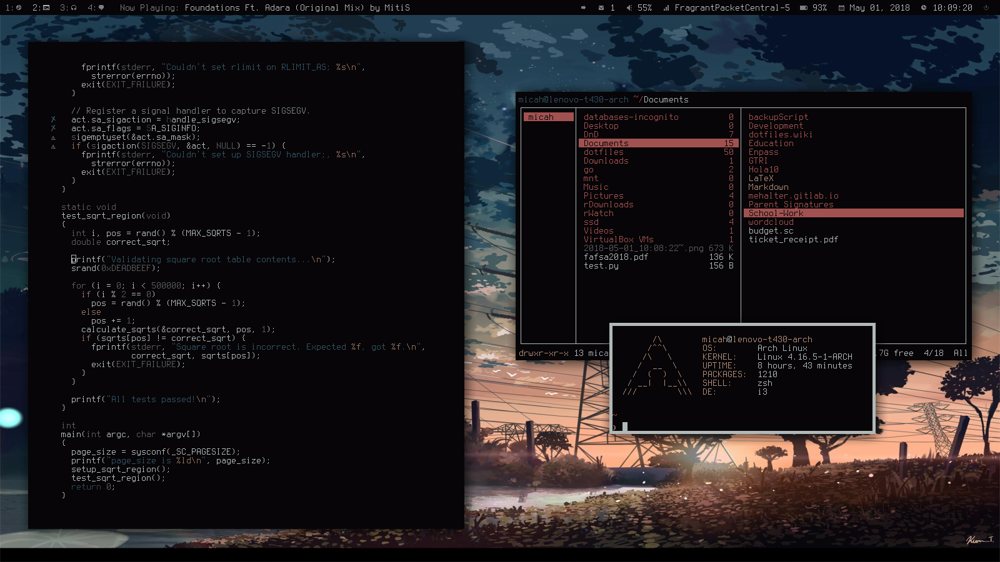

# dotfiles
My dotfiles for my Linux rice, managed using stow.

Check out the [wiki](https://gitlab.com/mehalter/dotfiles/wikis/home) for
documentation on the custom bindings that have been added to these applications

## Applications

### Window Management

- [i3-gaps](https://github.com/Airblader/i3)
- [i3lock-color](https://github.com/PandorasFox/i3lock-color)
- [polybar](https://github.com/jaagr/polybar)
- [j4-dmenu-desktop](https://github.com/enkore/j4-dmenu-desktop)

### Command Line Applications

- [cava](https://github.com/karlstav/cava)
- [gpymusic](https://github.com/christopher-dG/gpymusic)
- [htop](https://github.com/hishamhm/htop)
- [khal](https://github.com/pimutils/khal)
- [khard](https://github.com/scheibler/khard)
- [mps-youtube](https://github.com/mps-youtube/mps-youtube)
- [neomutt](https://github.com/neomutt/neomutt)
- [neovim](https://github.com/neovim/neovim)
- [newsboat](https://github.com/newsboat/newsboat)
- [qutebrowser](https://github.com/qutebrowser/qutebrowser)
- [ranger](https://github.com/ranger/ranger)
- [rtorrent](https://github.com/rakshasa/rtorrent)
- [rtv](https://github.com/michael-lazar/rtv)
- [sc-im](https://github.com/andmarti1424/sc-im)
+ [t](https://github.com/sjl/t)
- [tmux](https://github.com/tmux/tmux)
- [tmuxinator](https://github.com/tmuxinator/tmuxinator)
- urxvt
- [urxvt-perls](https://github.com/muennich/urxvt-perls)
- [weechat](https://github.com/weechat/weechat)
- [zathura](https://github.com/pwmt/zathura)
- zsh
- [zprezto](https://github.com/sorin-ionescu/prezto)
- Utilities
    - [arandr](https://github.com/haad/arandr)
    - [aria2c](https://github.com/aria2/aria2)
    - [compton](https://github.com/chjj/compton)
    - dmenu
    - [dunst](https://github.com/dunst-project/dunst)
    - [fd](https://github.com/sharkdp/fd)
    - [feh](https://github.com/derf/feh)
    - fprintd
    - [fzf](https://github.com/junegunn/fzf)
    - [gnupg](https://github.com/gpg/gnupg)
    - highlight
    - lxappearance
    - [mpv](https://github.com/mpv-player/mpv)
    - msmtp
    - [ncpamixer](https://github.com/fulhax/ncpamixer)
    - [offlineimap](https://github.com/OfflineIMAP/offlineimap)
    - [oomox](https://github.com/actionless/oomox)
    - [pass](https://www.passwordstore.org/)
    - [pass-extension-tail](https://github.com/palortoff/pass-extension-tail)
    - [pass-update](https://github.com/roddhjav/pass-update)
    - [pdfpc](https://github.com/pdfpc/pdfpc)
    + [picon](https://github.com/gokcehan/picon)
    - [py-wal](https://github.com/dylanaraps/pywal)
    - pygmentize
    - R
    - scrot
    - [stow](https://www.gnu.org/software/stow/)
    - [ufetch](https://github.com/jschx/ufetch)
    - [upass](https://github.com/Kwpolska/upass)
    - [urlview](https://github.com/sigpipe/urlview)
    - [vdirsyncer](https://github.com/pimutils/vdirsyncer)
    - [xclip](https://github.com/astrand/xclip)
    - [xdotool](https://github.com/jordansissel/xdotool)
    - [yay](https://github.com/Jguer/yay)

## Look and Feel

### Themes

- wal gtk theme
- [numix icon theme](https://github.com/numixproject/numix-icon-theme)

### Fonts

- [Terminus](http://terminus-font.sourceforge.net/)
- [siji](https://github.com/stark/siji)
